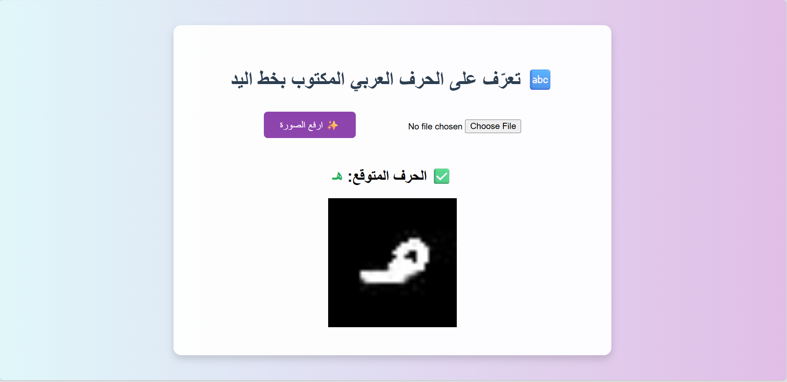

# 🖋️ Arabic Handwritten Character Recognition

مشروع يهدف إلى التعرف على الحروف الأبجدية العربية المكتوبة بخط اليد باستخدام نموذج شبكات عصبية (CNN) وواجهة مستخدم بسيطة مبنية باستخدام Flask.

---

## 🧠 Model Summary

- **Model Type:** Convolutional Neural Network (CNN)
- **Input Shape:** (32, 32, 1)
- **Dataset:** [Arabic Handwritten Characters Dataset (AHCD)](https://www.kaggle.com/datasets/mloey1/ahcd1)
- **Classes:** 28 حرف عربي
- **Normalization:** Pixel values scaled to [0, 1] by dividing by 255
- **Final Layer:** Softmax for class prediction

---

## 📁 Project Structure
The project directory contains the following files and folders:

```
arabic-handwritten-recognition/
│
├── model.h5                 # Trained CNN model for Arabic character recognition
├── app.py                  # Flask web app for deployment
├── templates/
│   └── index.html          # HTML frontend for uploading and displaying predictions
├── static/
│   ├── style.css           # Optional: CSS styling
│   └── uploads/            # Folder where uploaded images are saved (auto-created)
├── notebook.ipynb          # Jupyter notebook used for training and evaluation
├── requirements.txt        # Required Python packages
└── README.md               # Project documentation (this file)
```

---

## 🚀 How to Run Locally

1. **Clone the repository**
   ```bash
   git clone https://github.com/yourusername/arabic-handwritten-recognition.git
   cd arabic-handwritten-recognition
   ```

2. **Create a virtual environment (اختياري لكن يُفضّل)**
   ```bash
   python -m venv venv
   source venv/bin/activate     # على لينكس/ماك
   .\venv\Scripts\activate      # على ويندوز
   ```

3. **Install dependencies**
   ```bash
   pip install -r requirements.txt
   ```

4. **Run the Flask app**
   ```bash
   python app.py
   ```

5. افتح المتصفح على: `http://127.0.0.1:5000`  
   وارفع صورة لحرف مكتوب بخط اليد وشاهد التنبؤ!

---

## 🖼️ Sample Prediction Interface

واجهة التطبيق:




---

## 💡 Features

- يدعم رفع الصور والتنبؤ الفوري بالحرف العربي المكتوب بخط اليد.
- تصميم بسيط وسهل الاستخدام.
- دقة جيدة باستخدام CNN مدرّب على بيانات AHCD.
- سهل النشر محليًا باستخدام Flask.

---

## 🧪 Future Improvements

- تحسين واجهة المستخدم باستخدام Bootstrap أو React.
- دعم الكتابة الحية بالقلم (real-time drawing).
- رفع المشروع على منصة مثل [Render](https://render.com) أو [HuggingFace Spaces](https://huggingface.co/spaces).

---

## 🤝 Contributing

مرحب بأي مساهمات! افتح [Issue](https://github.com/yourusername/arabic-handwritten-recognition/issues) أو ابعت Pull Request لو عندك فكرة تحسين أو تعديل.

---

## 📜 License

MIT License. Feel free to use and modify with credit.
